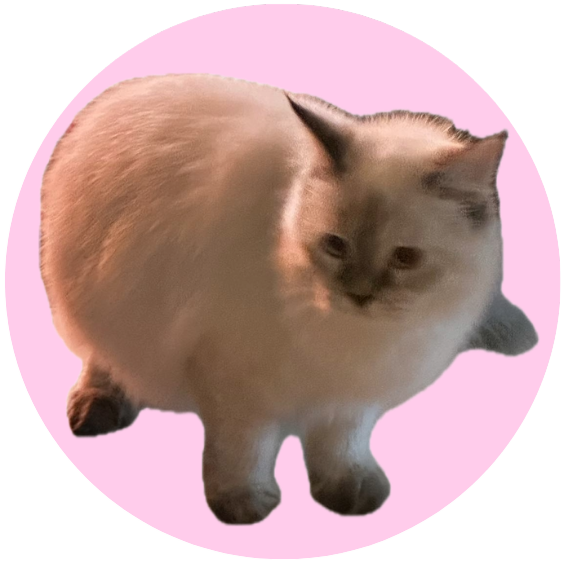

<a name="readme-top">

<br/>

<br />
<div align="center">
  <a href="https://github.com/nicollechoy/">
  <!-- TODO: If you want to add logo or banner you can add it here -->
    
  </a>
<!-- TODO: Change Title to the name of the title of your Project -->
  <h3 align="center">Final Project</h3>
</div>
<!-- TODO: Make a short description -->
<div align="center">
This website works as a complete portfolio that shows off creativity and technical skills. It includes a summary of qualifications and experience, as well as specific project showcases with links to their repositories.</div>

<br />

<!-- TODO: Change the zyx-0314 into your github username  -->
<!-- TODO: Change the WD-Template-Project into the same name of your folder -->


---

<br />
<br />

<!-- TODO: If you want to add more layers for your readme -->
<details>
  <summary>Table of Contents</summary>
  <ol>
    <li>
      <a href="#overview">Overview</a>
      <ol>
        <li>
          <a href="#key-components">Key Components</a>
        </li>
        <li>
          <a href="#technology">Technology</a>
        </li>
      </ol>
    </li>
    <li>
      <a href="#rule,-practices-and-principles">Rules, Practices and Principles</a>
    </li>
    <li>
      <a href="#resources">Resources</a>
    </li>
        <li>
      <a href="#wakatime">Wakatime</a>
    </li>
  </ol>
</details>

---

### Overview

<!-- TODO: To be changed -->
<!-- The following are just sample -->
Welcome to my personal website! This project showcases my work and coursework from the Web Development with Client-Side Scripting class, highlighting what I’ve learned. It features five different pages with unique designs and interactive buttons that are fun and easy to use. My skills in HTML, CSS, and layout helped me create a user-friendly site that shows off my design and web development abilities.

The goal of this portfolio is to apply what I’ve learned in a practical and creative way. It serves as a professional tool to highlight my skills, past projects, and creativity while demonstrating my web design and development capabilities. This website acts as a digital resume and a way to share my skills with potential employers or clients.

### Key Components
<!-- TODO: List of Key Components -->
<!-- The following are just sample -->
- MultiPage Website
- Animated Cards
- Hover Effects
- Interactive Features
- Project Showcase

### Technology
<!-- TODO: List of Technology Used -->


## Rules, Practices and Principles
1. Always use `WD-` in the front of the Title of the Project for the Subject followed by your custom naming.
2. Do not rename any .html files; always use `index.html` as the filename.
3. Place Files in their respective folders.
4. All file naming are in camel case.
   - Camel case is naming format where there is no white space in separation of each words, the first word is in all lower case while the succeding words first letter are in upper followed by lower cased letters.
   - ex.: buttonAnimatedStyle.css
5. Use only `External CSS`.
6. Renaming of Pages folder names are a must, and relates to what it is doing or data it holding.
7. File Structure to follow below.

```
WD-Finals
└─ assets
|   └─ css
|   |   └─ style.css
|   └─ img
|       └─ bga.jpg
|       └─ bgb.jpg
|       └─ homehomepage.gif
|       └─ homepage.gif
|       └─ logo.png
└─ pages
|  └─ aboutme
|  |  └─ assets
|  |  |  └─ css
|  |  |  |  └─ style.css
|  |  |  └─ img
|  |  |     └─ 1.png
|  |  |     └─ 2.png
|  |  |     └─ 3.png
|  |  |     └─ 4.png
|  |  |     └─ 5.png
|  |  |     └─ 6.png
|  |  |     └─ 7.png
|  |  |     └─ background.gif
|  |  |     └─ fb.webp
|  |  |     └─ ig.webp
|  |  |     └─ logo.png
|  |  |     └─ nicolle.jpg
|  |  |     └─ twtr.webp
|  |  └─ index.html
|  └─ contact
|  |  └─ assets
|  |  |  └─ css
|  |  |  |  └─ style.css
|  |  |  └─ img
|  |  |     └─ bgd.jpg
|  |  |     └─ bgh.png
|  |  |     └─ logo.png
|  |  └─ index.html
|  └─ otherwork
|  |  └─ assets
|  |  |  └─ css
|  |  |  |  └─ style.css
|  |  |  └─ doc
|  |  |  |  └─ work1.pdf
|  |  |  |  └─ work2.pdf
|  |  |  |  └─ work3.pdf
|  |  |  └─ img
|  |  |     └─ bgf.gif
|  |  |     └─ work1.jpg
|  |  |     └─ work2.jpg
|  |  |     └─ work3.jpg
|  |  └─ index.html
|  └─ projects
|  |  └─ assets
|  |  |  └─ css
|  |  |  |  └─ style.css
|  |  |  └─ img
|  |  |     └─ a.jpg
|  |  |     └─ b.png
|  |  |     └─ bge.jpg
|  |  |     └─ c.jpg
|  |  |     └─ d.jpg
|  |  └─ index.html
└─ index.html
└─ README.md
```
### My Projects
Explore my project repository:
- [WD-Hands on 1(midterm)](https://github.com/nicollechoy/WD-Midterms.git)
- [WD-Hands On 2](https://github.com/nicollechoy/WD-HandsOn2-Choy.git)
- [WD-Seatwork 2](https://github.com/nicollechoy/WD-Choy.git)
- [WD-Seatwork 3](https://github.com/nicollechoy/WD-SW3.git)
- [WD-Seatwork 4](https://github.com/nicollechoy/WD-SW4.git)
## Resources

<!-- TODO: Add References -->
| Title | Purpose | Link |
|-|-|-|
| Pinterest | Got background images | https://ph.pinterest.com/ |
| GoogleFonts | Got fonts | https://fonts.google.com/ |
| Github | Got some features from my previous projects | https://github.com/nicollechoy |
| Canva | Used to edit images for icons | https://www.canva.com/ |

### Wakatime
### Coding Activity
<a href="https://wakatime.com"></a>
### Languages
<a href="https://wakatime.com"></a>